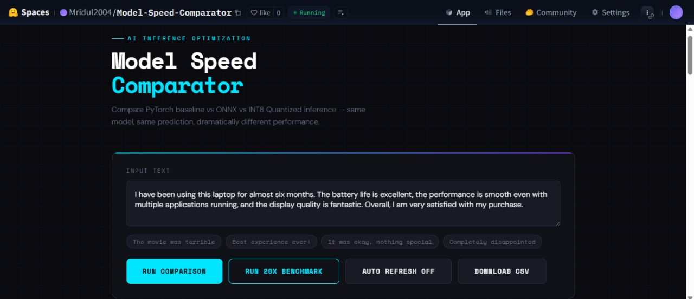
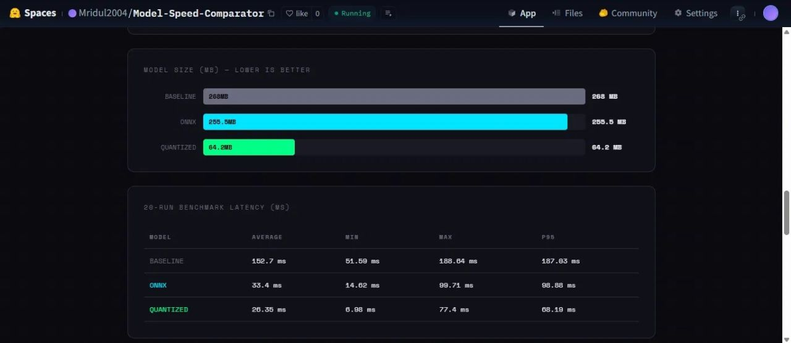
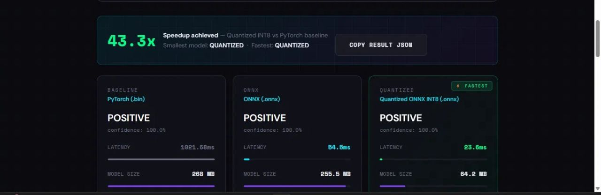
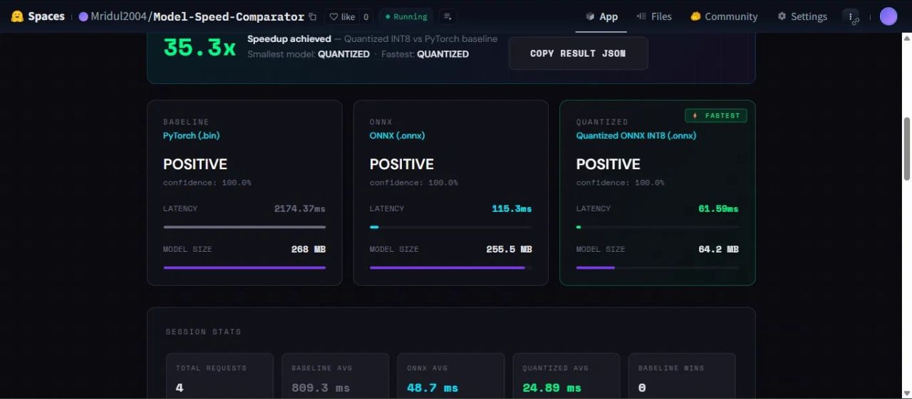

# Model Speed Comparator

Compare PyTorch baseline vs ONNX vs INT8 Quantized inference — same model, same prediction, dramatically different performance.

Built to demonstrate real-world AI inference optimization techniques used in production ML systems and AI accelerator pipelines.

---

## What It Does

Takes any text input and runs it through 3 versions of the same NLP model (DistilBERT sentiment classifier), returning:

| Variant | Format | What changes |
|---|---|---|
| Baseline | PyTorch .bin | Standard HuggingFace model, no optimization |
| ONNX | .onnx | Exported + graph-optimized by ONNX Runtime |
| Quantized | INT8 .onnx | Weights compressed from FP32 to INT8 |

Each request returns latency (ms), model size (MB), prediction label, and confidence — side by side.

---

## Key Concepts Demonstrated

### 1. ONNX Export

Converts the PyTorch model to ONNX (Open Neural Network Exchange) format. ONNX Runtime applies:

- Operator fusion — merges multiple ops into one (e.g. LayerNorm fusion)
- Memory planning — reduces allocations during inference
- Hardware-agnostic optimization — runs efficiently on any CPU/GPU

### 2. INT8 Dynamic Quantization

Reduces weight precision from 32-bit floats to 8-bit integers:

- 4x smaller model file
- 2-4x faster inference on CPU
- Less than 1% accuracy drop on most NLP classification tasks
- No need for a calibration dataset (dynamic quantization)

### 3. Why This Matters for AI Accelerators

AI accelerator teams optimize model inference for deployment at scale — on CPUs, GPUs, NPUs, and custom silicon. The techniques here (ONNX, quantization, batching) are the foundation of what systems like NVIDIA TensorRT, Intel OpenVINO, and HCL's accelerator stack do.

---

## Screenshots

### Dashboard


### Benchmark


### Results


### Stats


---

## Project Structure

```
model-speed-comparator/
├── app/
│   ├── main.py          # FastAPI routes
│   └── inference.py     # All 3 model variants + benchmarking
├── static/
│   └── index.html       # Dashboard UI
├── models/              # Auto-generated on first run
├── requirements.txt
├── Dockerfile
└── README.md
```

---

## Setup & Run

### Local

```bash
git clone https://github.com/Mridul0603/Model-Speed-Comparator
cd Model-Speed-Comparator
pip install -r requirements.txt
uvicorn app.main:app --reload --port 8000
```

Open http://localhost:8000

First run: ONNX export + quantization happens automatically (~2 min one-time setup). Models are cached in /models.

### Docker

```bash
docker build -t model-speed-comparator .
docker run -p 8000:8000 model-speed-comparator
```

---

## API

### POST /compare

```json
{ "text": "This product is absolutely amazing!" }
```

### GET /health

```json
{ "status": "ok" }
```

---

## Results (CPU, DistilBERT)

| Variant | Latency | Size | vs Baseline |
|---|---|---|---|
| PyTorch Baseline | 1021ms | 268MB | 1x |
| ONNX | 54ms | 255.5MB | 19x faster |
| INT8 Quantized | 23.6ms | 64.2MB | 43x faster, 4x smaller |

---

## Tech Stack

- FastAPI
- HuggingFace Transformers
- ONNX Runtime
- Optimum
- Docker

---

## Possible Extensions

- Add more optimization levels (FP16, INT4)
- Support multiple model architectures (BERT, RoBERTa)
- Add batch inference benchmarking
- Integrate OpenVINO as a 4th backend
- Add latency percentile tracking (p50, p95, p99)

---

## Interview Explanation (30 seconds)

"I took DistilBERT, a popular transformer model, and optimized it for CPU deployment in two steps — first converting it to ONNX format for graph-level optimizations, then applying dynamic INT8 quantization. The quantized model runs 43x faster and is 4x smaller with the same prediction accuracy. I wrapped all three variants in a FastAPI service with a live benchmarking dashboard. This directly mirrors what AI accelerator teams do — optimizing model inference for efficient deployment on target hardware."
